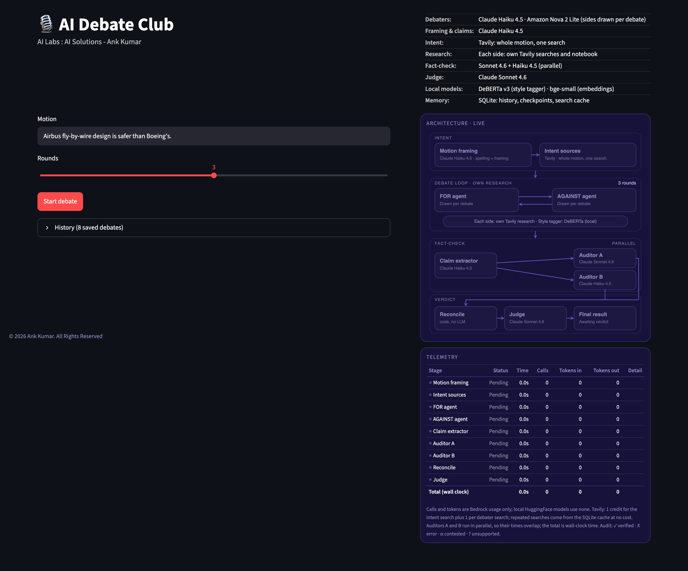
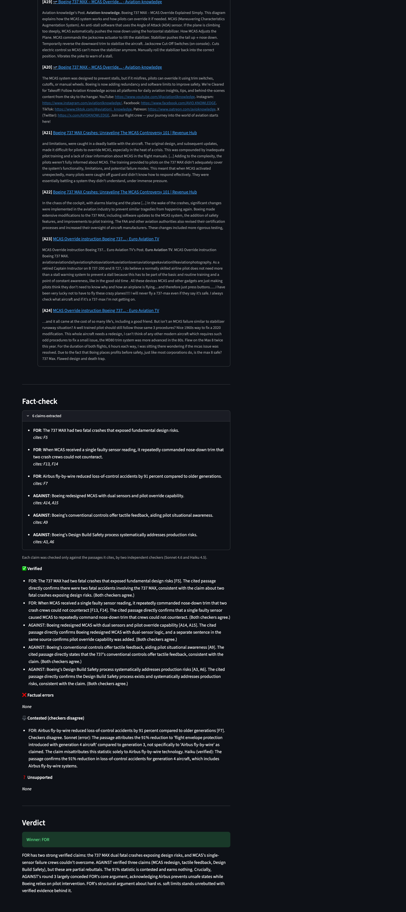

# AI Debate Club

A multi-agent debate engine. Two different LLMs argue any motion, research the web for
themselves, and cite their own evidence. Two independent auditors fact-check them, and a
judge decides. Built with LangGraph on Amazon Bedrock, with local HuggingFace models and
SQLite memory. Every motion is debated; there is no refusal stage.

## Screenshots

**Homepage**

**A full debate**

## Pipeline

1. **Intent**: the input is spelling-corrected and searched once on Tavily as a single
   phrase. Claude Haiku 4.5 frames the motion: both sides are kept whole, FOR is the
   first-named side, and the two positions are direct opposites. Hedged positions and
   swapped or dropped sides are caught in code, which reruns the framing.
2. **Debate** (N rounds): Claude Haiku 4.5 and Amazon Nova 2 Lite are research agents.
   Which one argues FOR is drawn per debate, to avoid a model bias. Each searches the web
   itself (Tavily tool), keeps its own notebook of F# or A# passages across turns, and
   cites it. A repetition guard re-asks a side that copies its previous turn.
3. **Style**: DeBERTa v3 zero-shot (local) scores each turn's emotional style, for display.
4. **Fact-check**: claims are extracted, and uncited ones are traced back to their source
   sentence. Sonnet 4.6 and Haiku 4.5 check them in parallel, each claim only against the
   passages it cites, and a quoted sentence must exist in the passage. Verdicts are
   reconciled in code.
5. **Judge**: Claude Sonnet 4.6 decides from the reconciled audit and the transcript.

## Memory (SQLite, debate_club.db)

- **Session**: LangGraph checkpointer, one thread per debate.
- **Overall**: debates, turns, notebook passages, claims, every step's output, and a
  Tavily cache, so repeated searches cost no credits. The History box replays any saved
  debate with no model calls.

## Setup

    python3.11 -m venv .venv
    .venv/bin/python -m pip install -r requirements.txt
    cp .env.example .env        # add your TAVILY_API_KEY

AWS credentials need Bedrock access to Claude Haiku 4.5, Claude Sonnet 4.6 and
Amazon Nova 2 Lite (us-east-1 by default).

## Run

    .venv/bin/python -m streamlit run app.py            # UI at http://127.0.0.1:8501
    .venv/bin/python debate.py "jinn vs hobbit ring"    # command line

## Cost per debate (3 rounds)

About 15 to 20 Bedrock calls. Tavily uses 1 credit for the intent search plus up to 2
per debater turn (up to 13 in total), and fewer when searches are already cached.

## Known limitations

- Only 6 claims (3 per side) are audited, so the judge decides from a sample.
- Source quality is not weighted: fan wikis and forums count the same as reference sources.
- The audit checks facts, not reasoning, so true premises can support a weak conclusion.
- The Tavily cache never expires.

## Files

| File | Purpose |
|---|---|
| debate.py | LangGraph engine: intent, research agents, fact-check, judge |
| app.py | Streamlit UI, history and replay |
| panel.py | Live architecture diagram and telemetry |
| memory.py | SQLite memory: checkpoints, history, Tavily cache |

(c) 2026 Ank Kumar. All Rights Reserved.
